*Notice: This app is no longer maintained here. Please visit https://github.com/redlor/Minitask for further development.*

# Minitask  

  

## About 
Minitask is a mini, lightweight (<5MB), and simple app for reminders/ todo list/ task management. The app is simple with very basic functions like task list, date time reminder and features a beautiful, efficient UI.  I made Minitask while I was learning Android Development. There has been various apps of the same function on the PlayStore, but making this app enables me to sharpen my Android skills and implement my idea.

## Download  

  

~~Will be on Google Play Store soon. For now you may get an unsigned APK at this repo's [Release Page](https://github.com/LewisVo/Minitask/releases/tag/1.0.0) or [here](https://apkshared.net/1MK5).~~

## Screenshot
 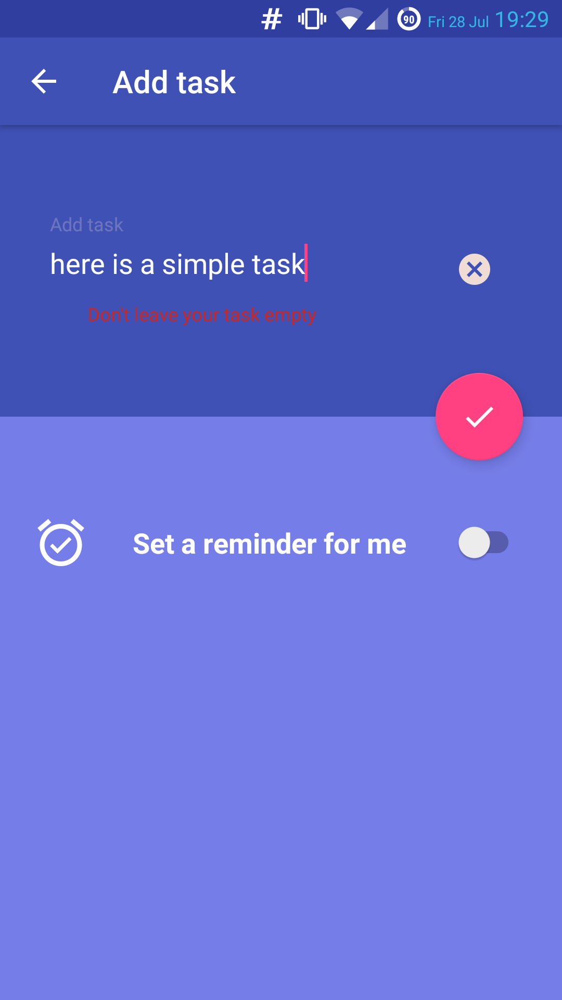 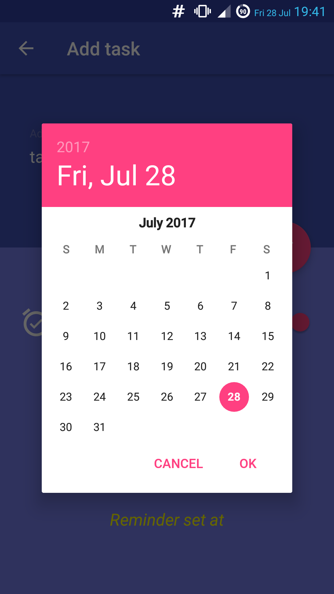 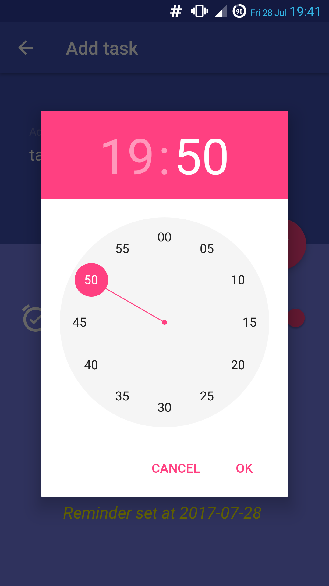 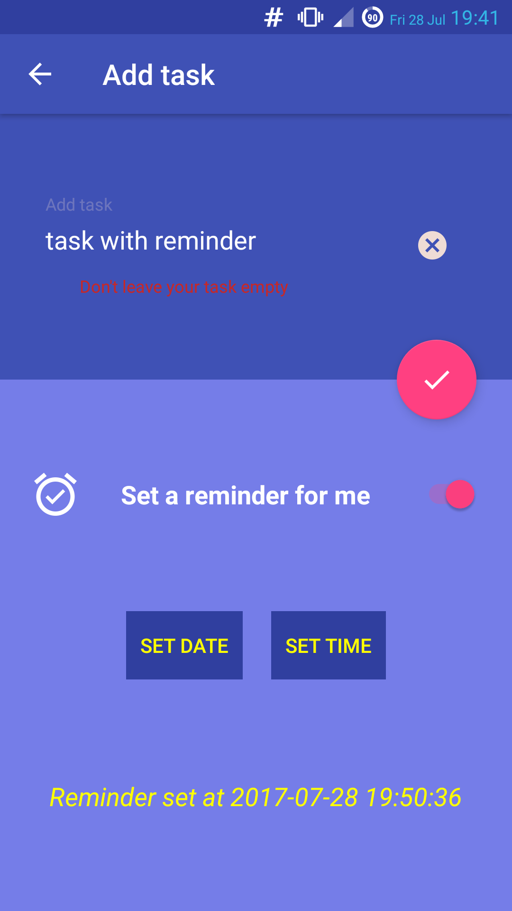 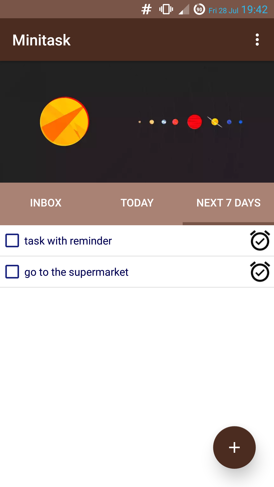 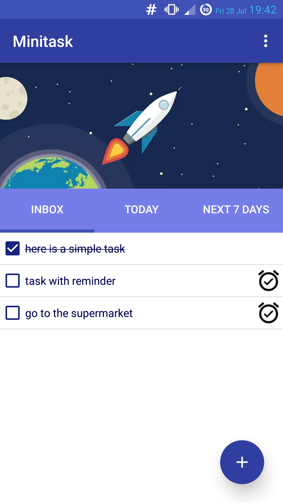 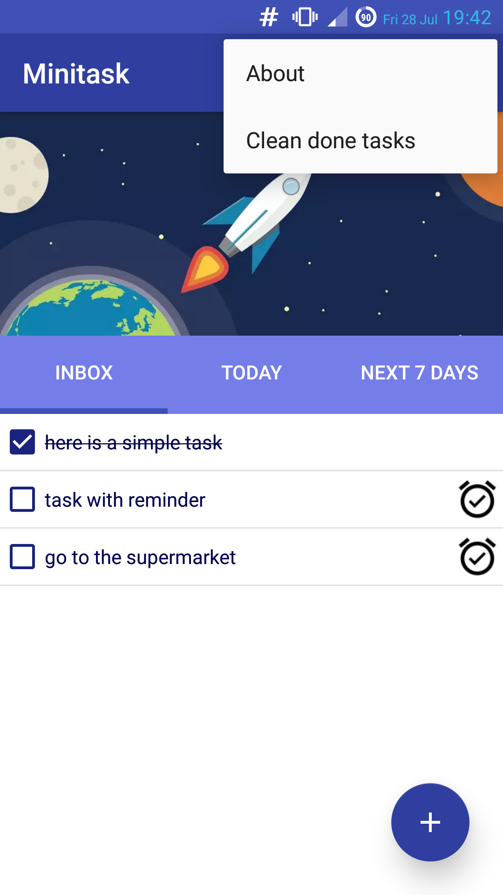 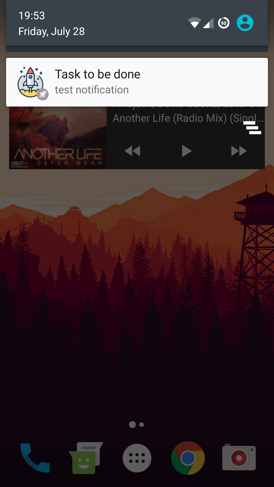 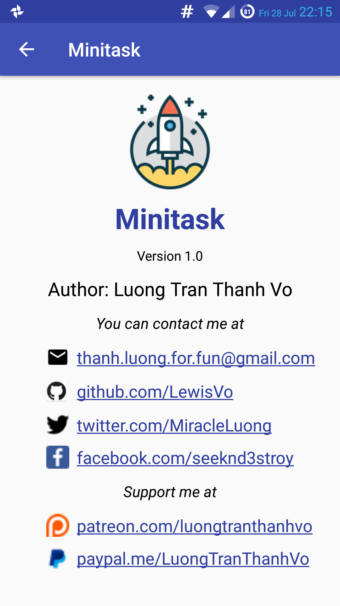 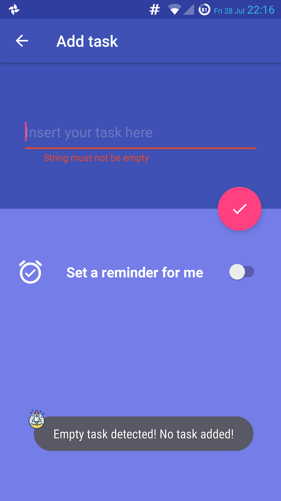 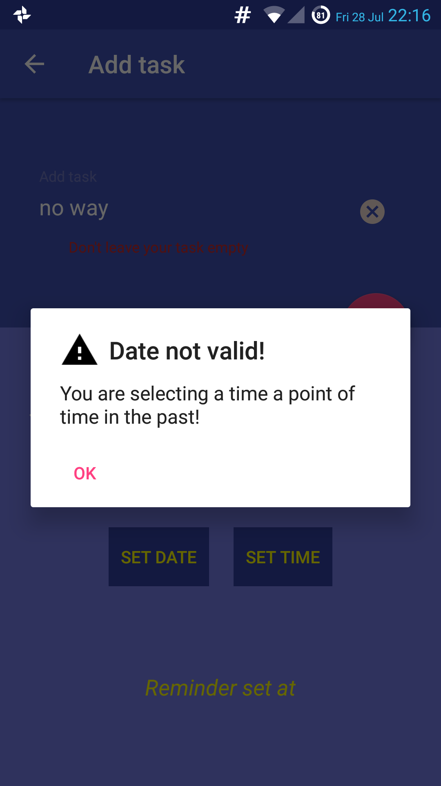

## Contributing  
PRs and discussions are welcomed. Translation is also appreciated.

## App icon credit
https://www.flaticon.com/free-icon/startup_341435#term=rocket&page=2&position=33  
https://www.flaticon.com/free-icon/rocket_122111#term=rocket&page=2&position=62

## License 
Apache License Ver 2.0
